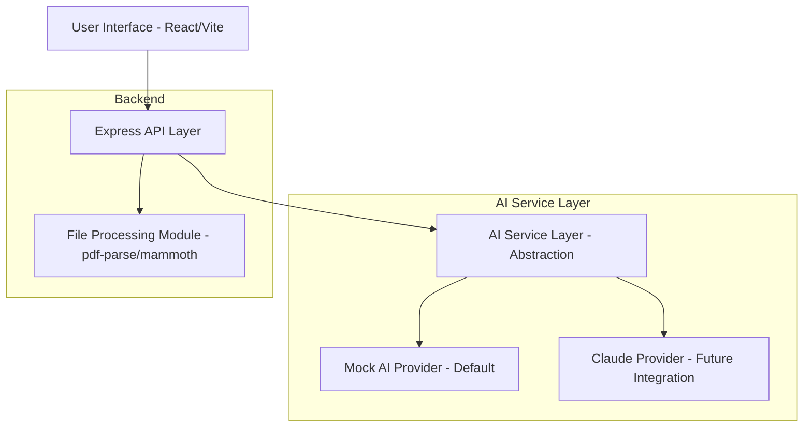

# JDify — AI-powered Job Description Generator

From messy hiring notes to polished Job Descriptions — instantly.

## 🏗️ System Architecture

## 🧩 Features

- **Input Ingestion**: Support for plain text, `.txt`, `.pdf`, and `.docx` files.
- **AI Abstraction**: Cleanly decoupled AI service layer allowing for easy swapping of providers (Mock vs Claude).
- **Search Query Generator**: Automatically generates Boolean strings for LinkedIn/GitHub searches.
- **Quality Scoring**: Rule-based scoring with actionable feedback.
- **Modern UI**: Split-screen design with Light/Dark mode, responsive layouts, and polished animations.

## ⚙️ Tech Stack

- **Frontend**: React 19, Tailwind CSS 4.
- **Backend**: Express 4, Node.js.
- **Styling**: Tailwind CSS with custom theme variables.
- **Animations**: `motion/react` (Framer Motion).
- **Icons**: `lucide-react`.

## 🚀 Getting Started

1. Set `AI_PROVIDER=mock` in your environment.
2. Run `npm run dev` to start the full-stack server.
3. Access the app at `http://localhost:3000`.

## 🛠️ Future Integrations

To enable Claude integration:
1. Implement the `ClaudeAIProvider` in `src/lib/ai/claude-provider.ts`.
2. Add your `ANTHROPIC_API_KEY` to secrets.
3. Set `AI_PROVIDER=claude` in your environment.
